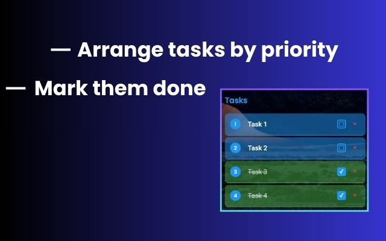

# Focus - Timer and Task Manager for Chrome ✓

Focus - Your best friend in checking off tasks. is a simple and intuitive to-do list app designed to help you organize tasks and stay productive. Easily create tasks, set priorities, and tick them off as you complete them. Stay on track with a built-in timer, perfect for focused work sessions and time management.

## Preview

  
  
  

## Features

- Create, edit, and delete tasks
- Built-in timer
- Arrange tasks by Priority
- Insights about focused time

## Installation

1. On your chrome or chromium browser go to chrome://extensions/ 
2. Click on "Load Uncpacked"
3. Select the folder "focus_extension"
3. You're done

## Technologies

- HTML/CSS/JavaScript
- Chrome Extension APIs
- Local Storage

## License

MIT License
