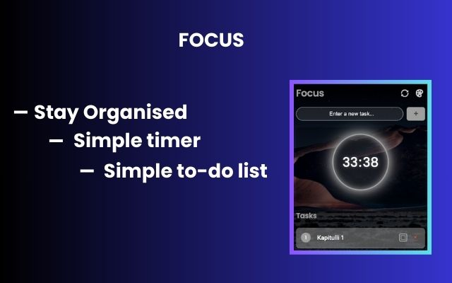

# checkmate
CheckMate - Your best friend in checking off tasks. is a simple and intuitive to-do list app designed to help you organize tasks and stay productive. Easily create tasks, set priorities, and tick them off as you complete them. Stay on track with a built-in timer, perfect for focused work sessions and time management. 

  
   
   

# Core features
1. Add, edit, and delete tasks.
2. Tick off completed tasks.
3. Built-in timer for focused work sessions (Pomodoro or custom).
4. Task prioritization (optional: color codes, labels).

